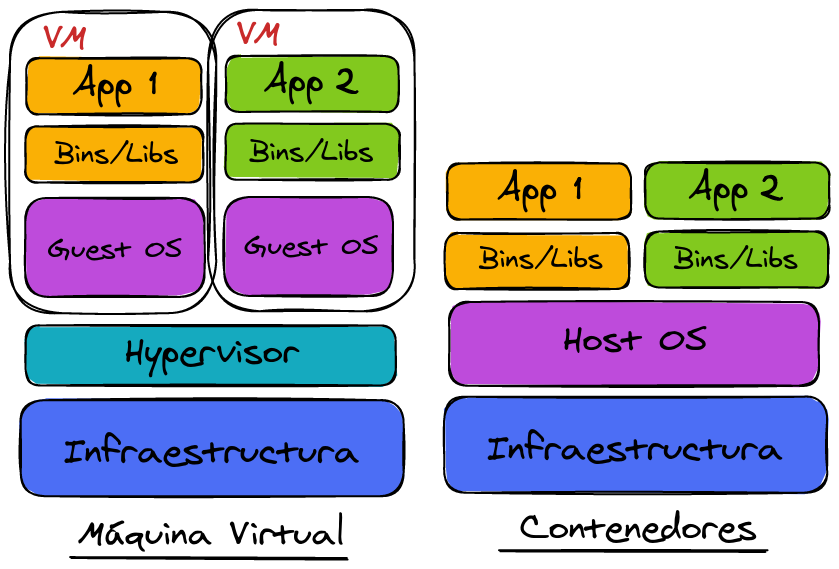
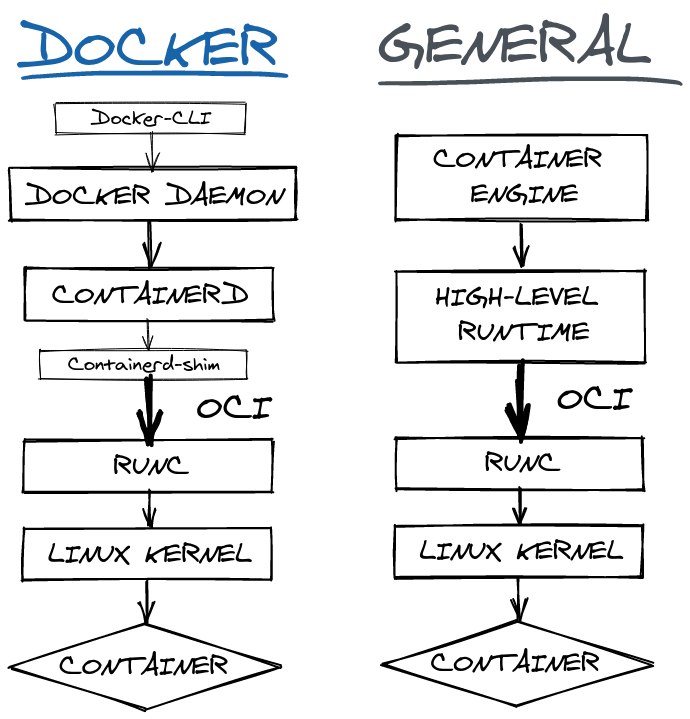

# Una aproximación a los contenedores
## ¿Qué es un contenedor?
La virtualización es un proceso mediante el cual un software es usado para crear una abstracción sobre unos recursos, dando la sensación de que los elementos hardware se dividen en varias computadores virtuales.

Existen dos tipos técnicas principales de virtualización:

1. Máquinas virtuales.
2. Contenedores (virtualización ligera).

!!! note "Definición"
    Un **contenedor** es un límite lógico que se crea dentro de un sistema operativo proporcionado por el aislamiento de recursos hardware.

    La característica principal es que en esta técnica se utilizan herramientas que proporciona el Linux Kernel (como _cgroups_ y _namespaces_).

## Diferencia entre MV y contenedores

<figure>

<figcaption>Diferencia infraestructura: VM y contenedor</figcaption>
</figure>

* Un contenedor es una forma de **virtualización ligera**. 
* Normalmente envuelve a un **pequeño grupo de procesos**.
* Los contenedores **comparten el _kernel_** con el host.
* Dentro del contendor se encuentra **únicamente el código, librerías y ejecutables estrictamente necesarios**.

!!! info ""

    === "Usos principales"

        * **Microservicios**: los contenedores **son ligeros y envuelven servicios muy pequeños**, lo que los hace muy aptos para su uso en microservicios.
        * **DevOps + CI/CD**: facilita el ciclo _"build, test and deploy".
        * **Cloud**: los contenedores pueden **funcionar** de forma consistente en prácticamente **cualquier lugar**.

    === "Ventajas principales"

        * **Rapidez y ligereza**.
        * **Portabilidad e independencia de plataformas**.
        * **Escalabilidad**.

    === "Desventajas principales"

        * **Seguridad**: el aislamiento entre contenedores y el host es menor: puede provocar vulnerabilidades.
        * **Monitorización**: existen varias capas que monitorizar aunque sólo se tenga una aplicación en un contenedor.
        * **Complejidad a gran escala**.

## Historia de contenedores

### Chroot (1979)
`chroot` es una llamada al sistema que permite **cambiar el directorio raiz de un proceso y de sus hijos** a un nuevo lugar dentro del sistema de archivos. Esto hace que un grupo de procesos tengan una **visión limitada del almacenamiento** del sistema.

El principal **problema** de `chroot` es que los procesos con permisos de root se pueden **saltar el aislamiento** con facilidad.

### FreeBSD Jails (2000)
Fue el **primer "pseudo-contenedor"** y el impulsor de las tecnologías de los contenedores que existen hoy en día.

Su objetivo era **"confinar el root omnipotente"**, que da nombre al documento donde se presenta la herramienta.

Las Jails dan uso a `chroot` añadiendo nuevos mecanismos existentes en el sistema operativo. En cada _jail_ los procesos pueden **manipular únicamente los servicios y archivos a los que se le da acceso** (por ello se le dio el nombre de _jail_: cárcel en inglés, como si los procesos estuvieran en prisión). El administrador del sistema puede separar el sistema en varias celdas asignando un superusuario a cada una **sin perder el control** del sistema completo.

Para **mantener la seguridad** deseada se **desactivaron ciertas llamadas al sistema** (para evitar, por ejemplo, el _spoofing_), aunque esto impida utilizar ciertas instrucciones comunes como el comando `ping`.

Por último, **cada celda tiene sus propios UID y GID**: un mismo usuario en una celda puede corresponderse con otro usuario en distinta celda.

### Solaris Zones (2004)
Los creadores de esta tecnología no sólo buscaban **mantener la seguridad**, sino también **mejorar el uso de recursos a gran escala**. De hecho, se pretendía dar soporte a aplicaciones comerciales potencialmente escalables.

El objetivo era lograr que los **administradores** necesitaran pocos minutos para **configurar y lanzar una nueva _zone_**: el sistema se encargaría de crearla automáticamente añadiendo los límites en recursos compartidos que se consumían (inicialmente sólo CPU).

El administrador puede configurar las propiedades de las _zones_ en tiempo real o mediante scripts.

Existen dos tipos de _zones_:

* _Global zone_: es la _zone_ por defecto que tiene control sobre todos los procesos. Siempre existe aunque no se haya creado ninguna manualmente.
* _Non-global zone_: son las _zones_ configuradas desde la global.

Algo a tener en cuenta es que las Zones se preocupan por **mantener ciertas utilidades** sin dejar a un lado la seguridad (por ejemplo, permite utilizar el comando `ping` a diferencia de las _jails_).

### Cgroups y Namespaces (2006-2007)
En el 2006 se propuso un _framework_ que **agrupa procesos** y aprovecha los mecanismos de control existentes del _kernel_. El objetivo era que los **usuarios se centren en el controlador de recursos** y se abstraigan de cómo los procesos son gestionados y monitorizados.

Este mecanismo en un principio se llamaba _process containers_ pero se cambió el nombre a **_cgroups_** para diferenciarlo de los contenedores que conocemos hoy en día.

Por otro lado, en el 2002 se creó el primer **_namespace_**, el _mount namespace_. Aunque fue más adelante a partir del año 2007 cuando se comenzó a ver el potencial que podían tener junto a otras funcionalidades como los _cgroups_, así que se empezaron a desarrollar nuevos _namespaces_. En la actualidad existen ocho.

### LXC (2008)
Los LXC se podrían considerar los primeros contenedores tal y como conocemos el concepto hoy en día: fue la **primera tecnología en aplicar los dos elementos principales de los contenedores: _cgroups_ y _namespaces_**.

Permite al usuario comunicarse con las facilidades que ofrecen las funcionalidades del _kernel_ mediante una **interfaz en línea de comandos**. Sin embargo, no es una herramienta apropiada para realizar tareas de gestión de contenedores en un alto nivel.

### LMCTFY y Docker (2013)
**LMCTFY** (Let Me Containerize That For You) fue la versión open-source del **stack de Google** a los contenedores de Linux. Su desarrollo **finalizó en 2015** y Google comenzó a transferir parte de la implementación a _libcontainer_ ahora mismo es una parte fundamental del stack de Docker y forma parte de OCI.

Por otro lado, **Docker** supuso un despunte en la popularidad de los contenedores en el año de su salida y el crecimiento de ambos conceptos han ido de la mano desde entonces siendo **hoy en día líder en este ámbito**.

En sus inicios utilizaba LXC, pero más tarde lo sustituyó por su propia librería _libcontainer_.

### OCI (2015)
**OCI** (Open Container Initiative) es un proyecto de la Linux Foundation cuyo objetivo es **diseñar un estándar abierto para la virtualización basada en contenedores**. Fue establecida en 2015 por Docker y otros líderes de la industria.

Después del lanzamiento de Docker, surgió una comunidad alrededor de los contenedores. Sin embargo, con el paso del tiempo fueron apareciendo nuevas tecnologías y herramientas que satisfacían las neceseidades que iban surgiendo. Este fue el motivo principal por el que surgió este estándar.

Actualmente, OCI define dos especificaciones, aunque [hablaremos más tarde de ellas en este documento](#chroot-1979) *******OJOOOOOOOOOOOOOOOOOOOOOOOOOOOOOOOO********

### Otras tecnologías
A lo largo de las dos últimas décadas han ido surgiendo otras tecnologías de virtualización de sistema operativo, pero han sido menos importantes para el ecosistema de los contenedores que las anteriormente mencionadas.

Entre ellas podemos encontrar **Linux VServer** (2001), **OpenVZ** (2005), **Warden** (2011), **Singularity** (2015) o **Podman** (2018).

## Arquitectura de los contenedores

<figure>

<figcaption>Generalización de la arquitectura de los contenedores a partir de la arquitectura de Docker</figcaption>
</figure>