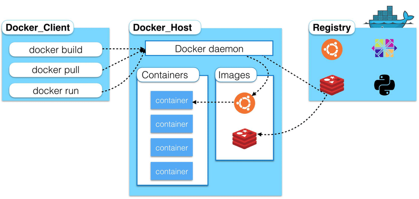

# Una aproximación a los contenedores
## ¿Qué es un contenedor?
La **virtualización** es un proceso mediante el cual un software es usado para crear una **abstracción sobre unos recursos**, dando la sensación de que los **elementos hardware se dividen en varias computadores virtuales**.

Existen dos técnicas principales de virtualización:

1. **Máquinas virtuales**.
2. **Contenedores** (virtualización ligera).

!!! note "Definición"
    Un **contenedor** es un **límite lógico** que se crea dentro de un sistema operativo proporcionado por el aislamiento de recursos hardware.

    La característica principal es que en esta técnica se utilizan herramientas que proporciona el Linux Kernel (como _cgroups_ y _namespaces_).

## Diferencia entre MV y contenedores

<figure>

<figcaption>Diferencia infraestructura: VM y contenedor</figcaption>
</figure>

* Un contenedor es una forma de **virtualización ligera**. 
* Normalmente envuelve a un **pequeño grupo de procesos**.
* Los contenedores **comparten el _kernel_** con el host.
* Dentro del contendor se encuentra **únicamente el código, librerías y ejecutables estrictamente necesarios**.


!!! info ""

    === "Usos principales"

        * **Microservicios**: los contenedores **son ligeros y envuelven servicios muy pequeños**, lo que los hace muy aptos para su uso en microservicios.
        * **DevOps + CI/CD**: facilita el ciclo "_build, test and deploy_".
        * **Cloud**: los contenedores pueden funcionar de forma consistente en, prácticamente, **cualquier lugar**.

    === "Ventajas principales"

        * **Rapidez y ligereza**.
        * **Portabilidad e independencia de plataformas**.
        * **Escalabilidad**.

    === "Desventajas principales"

        * **Seguridad**: el aislamiento entre contenedores y el host es menor: puede provocar vulnerabilidades.
        * **Monitorización**: existen varias capas que monitorizar aunque sólo se tenga una aplicación en un contenedor.
        * **Complejidad a gran escala**.


## Historia de contenedores

### Chroot (1979)
`chroot` es una llamada al sistema que permite **cambiar el directorio raiz de un proceso y de sus hijos** a un nuevo lugar dentro del sistema de archivos. Esto hace que un grupo de procesos tengan una **visión limitada del almacenamiento** del sistema.

El principal **problema** de `chroot` es que los procesos con permisos de root se pueden **saltar el aislamiento** con facilidad.

### FreeBSD Jails (2000)
Fue el **primer "pseudo-contenedor"** y el impulsor de las tecnologías de contenedores que existen hoy en día.

Su objetivo era **"confinar el root omnipotente"**, que da nombre al [documento](http://www.sane.nl/events/sane2000/papers/kamp.pdf) donde se presenta la herramienta.

Las Jails dan uso a `chroot` añadiendo nuevos mecanismos existentes en el sistema operativo. En cada _jail_ los procesos pueden **manipular únicamente los servicios y archivos a los que se le da acceso** (por ello se le dio el nombre de _jail_: cárcel en inglés, como si los procesos estuvieran en prisión). El administrador del sistema puede separar el sistema en varias celdas asignando un superusuario a cada una **sin perder el control** del sistema completo.

Para **mantener la seguridad** deseada se **desactivaron ciertas llamadas al sistema** (para evitar, por ejemplo, el _spoofing_), aunque esto impida utilizar ciertas instrucciones comunes como el comando `ping`.

Por último, **cada celda tiene sus propios UID y GID**: un mismo usuario en una celda puede corresponderse con otro usuario en distinta celda.

### Solaris Zones (2004)
Los creadores de esta tecnología no sólo buscaban **mantener la seguridad**, sino también **mejorar el uso de recursos a gran escala**. De hecho, se pretendía dar soporte a aplicaciones comerciales potencialmente escalables.

El objetivo era lograr que los **administradores** necesitaran pocos minutos para **configurar y lanzar una nueva _zone_**: el sistema se encargaría de crearla automáticamente añadiendo los límites en recursos compartidos que se consumían (inicialmente sólo CPU).

El administrador puede configurar las propiedades de las _zones_ en tiempo real o mediante scripts.

Existen dos tipos de _zones_:

* _Global zone_: es la _zone_ por defecto que tiene control sobre todos los procesos. Siempre existe aunque no se haya creado ninguna manualmente.
* _Non-global zone_: son las _zones_ configuradas desde la global.

Algo a tener en cuenta es que las Zones se preocupan por **mantener ciertas utilidades** sin dejar a un lado la seguridad (por ejemplo, permite utilizar el comando `ping`, a diferencia de las _jails_).

### Cgroups y Namespaces (2006-2007)
En el 2006 se propuso un _framework_ que **agrupa procesos** y aprovecha los mecanismos de control existentes del _kernel_. El objetivo es que los **usuarios se centren en el controlador de recursos** y se abstraigan de cómo los procesos son gestionados y monitorizados.

Este mecanismo, en un principio, se llamaba _process containers_ pero se cambió el nombre a **_cgroups_** para diferenciarlo de los contenedores que conocemos hoy en día, que usan otros mecanismos a parte de los _cgroups_.

Por otro lado, en el 2002 se creó el primer **_namespace_**, el _mount namespace_. Aunque fue más adelante a partir del año 2007 cuando se comenzó a ver el potencial que podían tener los _namespaces_ junto a otras funcionalidades como los _cgroups_, así que se empezaron a desarrollar nuevos tipos. En la actualidad existen ocho _namespaces_.

### LXC (2008)
Los LXC se podrían considerar los primeros contenedores tal y como conocemos el concepto hoy en día: fue la **primera tecnología en aplicar los dos elementos principales de los contenedores: _cgroups_ y _namespaces_**.

Permite al usuario comunicarse con las facilidades que ofrecen las funcionalidades del _kernel_ mediante una **interfaz en línea de comandos**, sin embargo, no es una herramienta apropiada para realizar tareas de gestión de contenedores en un alto nivel.

### LMCTFY y Docker (2013)
**LMCTFY** (_Let Me Containerize That For You_) fue la versión open-source del **stack de Google** a los contenedores de Linux. Su desarrollo **finalizó en 2015** y Google comenzó a transferir parte de la implementación a _libcontainer_. Ahora mismo es una parte fundamental del stack de Docker y forma parte de OCI.

Por otro lado, **Docker** supuso un despunte en la popularidad de los contenedores en el año de su salida y el crecimiento de ambos conceptos han ido de la mano desde entonces siendo **hoy en día líder en este ámbito**. En sus inicios utilizaba LXC, pero más tarde lo sustituyó por su propia librería _libcontainer_.

### OCI (2015)
**OCI** (_Open Container Initiative_) es un proyecto de la Linux Foundation cuyo objetivo es **diseñar un estándar abierto para la virtualización basada en contenedores**. Fue establecida en 2015 por Docker y otros líderes de la industria.

Después del lanzamiento de Docker, surgió una comunidad alrededor de los contenedores. Con el paso del tiempo fueron apareciendo nuevas tecnologías y herramientas que satisfacían las neceseidades que iban surgiendo. Este fue el motivo principal por el que surgió este estándar.

Actualmente, OCI define dos especificaciones, aunque [hablaremos de ellas más tarde en este documento](#runc-parte-del-stack-de-docker).

### Otras tecnologías
A lo largo de las dos últimas décadas han ido surgiendo otras tecnologías de virtualización de sistema operativo, pero han sido menos importantes para el ecosistema de los contenedores que las anteriormente mencionadas.

Entre ellas podemos encontrar a **Linux VServer** (2001), **OpenVZ** (2005), **Warden** (2011), **Singularity** (2015) o **Podman** (2018).

## Arquitectura de los contenedores
Dada la ambigüedad con la que muchos profesionales se refieren a cada una de las capas que forman esta arquitectura y, dado que, dependiendo de la tecnología a usar, pueden cambiar ligeramente las funciones que realizan sus componentes, se utilizará como referencia el stack de Docker.


<figure>

<figcaption>Generalización de la arquitectura de los contenedores a partir de la arquitectura de Docker</figcaption>
</figure>

Comenzaremos el estudio por la parte inferior de la imágen, en los componentes del Linux Kernel, para ir subiendo hasta llegar al _Container Engine_.

### 1º Componentes del Linux Kernel
Existen numerosos componentes y herramientas del kernel que utilizan los contenedores para aislar los procesos. En concreto aquí estudiaremos cinco de ellos, siendo los más importantes los dos primeros:

#### Namespaces
!!! note "Definición de namespaces"
    Proporcionan el **aislamiento entre procesos** mediante la **encapsulación de ciertos recursos** del sistema. De esta forma, hacen creer a los procesos dentro de un contenedor que tienen su propia instancia del recurso, aunque realmente lo están compartiendo.

Esta herramienta impide que, mediante una vulnerabilidad en un contenedor, unos intrusos puedan acceder a la máquina completa comprometiéndola.

La API del kernel que facilita esta característica tiene tres llamadas principales:

| Llamada      | Descripción                          |
| ----------- | ------------------------------------ |
| `clone`       | Crea un proceso hijo ,al igual que `fork`, pero proporcionando más control sobre qué partes del contexto se comparten.  |
| `unshare`       | Crea un nuevo _namespace_ y ejecuta un nuevo proceso dentro de éste. |
| `setns`    | Mueve el hilo actual dentro de un _namespace_ existente |
| `ioctl` | Ofrece información sobre _namespaces_  (la información se maneja desde `/proc/$PID/ns`)|

En la actualidad existen 8 _namespaces_ distintos, cada uno de ellos proporciona un **distinto tipo de aislamiento**:


??? summary "Tipos de namespaces"

    === "MNT NS"

        **Mount Namespace**

        Fue el primer _namespace_ implementado. En aquel momento no se sabía que iban a crearse más tipos de _namespaces_ así que su _flag_ correspondiente en los comandos de `clone` y `unshare` es `CLONE_NEWNS`.

        !!! note "Función"
            Proporciona **aislamiento** a las estructuras de datos que utiliza el sistema para gestionar los **puntos de montaje**. De esta forma, los procesos en distinto _mount namespace_ tienen una visión distinta de la jerarquía de los sistemas de archivos.

        Algunos usos que ofrece son:

        * Cada usuario puede tener su propio `/tmp` para aumentar la seguridad frente a un usuario malicioso.
        * Distintos procesos pueden tener un sistema de archivos raíz (es un concepto parecido a `chroot`).
        * Los puntos de montaje pueden ser privados o compartidos.


    === "UTS NS"

        **UNIX Time-Sharing**

        Desde la implementación del anterior _namespace_ hasta éste pasaron 4 años. Es el más sencillo de entender.

        !!! note "Función"
            **Aísla el _hostname_ y el _domain-name_** del contenedor.

        La _flag_ correspondiente es `CLONE_NEWUTS`.
        


    === "IPC NS"

        **Inter Process Communication**

        !!! note "Función"
            **Aísla la compartición de ciertos recursos que facilitan la comunicación** como la memoria, objetos System V IPC y colas de mensajes POSIX.

        Sin embargo, después de un `clone` se siguen compartiendo señales, sockets, descriptores de archivos o sondeos de memoria (habría que aislarlos con otras técnicas).

        Su flag correspondiente es `CLONE_NETIPC`.
    


    === "PID NS"

        **Process ID**

        Los procesos de un sistema pertenecen a un árbol de procesos global visible únicamente por el _host_.

        !!! note "Función"
            Este _namespace_ crea un nuevo **árbol de procesos** propio de cada contenedor.

        Los **procesos** que estén dentro de este _namespace_ **pertenecen**, por tanto, **a dos árboles**, el global y el propio del _namespace_. De esta forma, un mismo proceso puede tener varios PIDs dependiendo de en qué árbol se consulte.

        <figure>
            
            <figcaption>Distintos árboles para distintos _namespaces_.</figcaption>
        </figure>

        El primer PID dentro del nuevo _namespace_ siempre es el 1. Este proceso debería tener unas características únicas para poder funcionar como _init_ y así poder tener más de un proceso en un contenedor.

        Uno de los principales beneficios que presenta es que los contenedores se pueden migrar de una máquina a otra manteniendo el árbol de procesos.

        Su _flag_ es `CLONE_NEWPID`.


    === "NET NS"

        **Network**

        !!! note "Función"
            Proporciona **aislamiento de los recursos de red**, donde cada contenedor puede tener su propio stack de recursos: tablas de enrutado, reglas de _iptables_, _sockets_, etc.


        La _flag_ correspondiente es `CLONE_NEWNET`.


    
    === "User NS"

        !!! note "Función"
            Permite que **los procesos puedan creer que están operando como root** dentro de un contenedor, pero fuera del contenedor tienen realmente los privilegios de un usuario común.

        Antes de que existiera este _namespace_, si un proceso tenía permisos de root en cualquier entorno de aislamiento, también lo tenía en el sistema global, lo que era un problema en lo que a la seguridad se refiere.

        En este _namespace_, el UID dentro del _namespace_ siempre se corresponderá con otro fuera de él en el host. Este mapeo se puede hacer manualmente y elegir qué UID se selecciona dentro del contenedor para un usuario global.

        Un ejemplo de mapeo entre las dos tablas de usuarios se puede observar en la siguiente imagen.

        <figure>
            
            <figcaption>Ejemplo de mapeo entre un UID del host con un UID dentro del contenedor</figcaption>
        </figure>

        La _flag_ correspondiente es `CLONE_NETUSER`.


    
    === "Cgroup NS"

        Los _cgroups_ (grupos de control en español) son una funcionalidad del kernel de Linux que trataremos en la [sección](#control-groups) que, básicamente, implementan monitorización y limitación de los recursos que consume un grupo de procesos.

        !!! note "Función"
            **Virtualiza la vista de los grupos de control** que ven los procesos. Sin esta restricción, un proceso podría observar los grupos de control globales y acceder a la información sobre la limitación de recursos de otros procesos.

        Tiene dos funciones principales:

        1. Evita que un grupo de control acceda a los límites de otro superior a él.
        2. Facilita la migración de contenedores al aislar unos grupos de otros. De esta forma podemos ahorrar la necesidad de replicar los límites según se van trasladando los contenedores.

        La _flag_ correspondiente es `CLONE_NEWCGROUP`.


    === "Time NS"

        !!! note "Función"
            **Virtualiza dos relojes del sistema** permitiendo que, cuando un contenedor se migra de un nodo a otro, estos **relojes son restaurados de forma consistente** partiendo siempre del tiempo que tenía el reloj antes de ser migrado.

        Estos dos relojes son el `CLOCK_MONOTONIC` y `CLOCK_BOOTTIME`.

        La _flag_ correspondiente es `CLONE_NEWTIME`.


#### Control Groups

Antes de que se crearan los grupos de control existían formas para **monitorizar y controlar procesos individuales**, pero **no había soporte** para aplicar esas mismas operaciones **a grupos de procesos**. Por eso se acabaron implementando los _Process Containers_, que luego se renombraron a _cgroups_.

!!! note "Definición de Cgroups"

    Son un **_framework_** basado en los mecanismos existentes del kernel para **proporcionar una interfaz y un alcance más global a las operaciones de control y monitorización** de procesos.

    Los grupos de control permiten **repartir y asignar recursos entre un grupo de tareas o procesos** del sistema.


Los grupos de control ofrecen cuatro características principales:

1. **Limitación de recursos**, como procesador, memoria, dispositivos E/S, etc.
2. **Priorización**, que es parecida a la anterior característica, pero no limita recursos a procesos sino que le da preferencia en el consumo de recursos a un proceso seleccionado.
3. **Monitorización** de un grupo de procesos para obtener información de qué procesos están consumiendo cuántos recursos.
3. **Freezing de procesos**. Esta es una herramienta que permite paralizar y retomar grupos de procesos. Es muy utilizada en el procesamiento por lotes.

Existen dos versiones de **Cgroups**, hoy en día se está intentando hacer la transición en la mayoría de herramientas a la segunda versión. Para comprender esta última versión necesitamos entender tres conceptos:

* **Cgroup**: es un grupo de tareas al que se le asocia uno o más subsistemas.
* **Subsistema o _resource controller_**: representa un único recurso, como la memoria o el tiempo de CPU.
* **Jerarquía**: es el conjunto de todos los _cgroups_ en forma de árbol. Cada proceso del sistema está en un _cgroup_ determinado. Cada nodo (o sea, cada _cgroup_) del árbol tiene asociados uno o más subsistemas. En la versión 2 de los _cgroups_ existe una sóla jerarquía.

En la siguiente imagen podemos observar un ejemplo de jerarquía, donde existen cuatro _cgroups_ distintos. Cada uno de ellos tiene asociados varios subsistemas. En el caso del Group_2 los subsistemas asociados son "memoria" y "pids", y sus grupos hijos heredan los mismos subsistemas, pero pueden asociar otros nuevos o disociar los heredados.

<figure>
    
    <figcaption>Ejemplo de jerarquía de grupos de control.</figcaption>
</figure>

Cada grupo se añade creando un nuevo directorio dentro de la carpeta raíz `/sys/fs/cgroup`. En el momento de crear dicha carpeta, el sistema añade los archivos necesarios para gestionar los _cgroups_.

??? note "¿Cómo añadimos los grupos de control de este ejemplo?"
    Los subsistemas del siguiente ejemplo se añadirían creando en primer lugar cada _cgroup_ y más tarde escribiendo en los subsistemas en los archivos autogenerados:

    ```bash
    mkdir /sys/fs/cgroup/Cgroup_1
    mkdir /sys/fs/cgroup/Cgroup_2
    mkdir /sys/fs/cgroup/Cgroup_2.1
    mkdir /sys/fs/cgroup/Cgroup_2.2

    echo "+memory +io" > /sys/fs/cgroup/Group_1/cgroup.subtree_control
    echo "+memory +pids" > /sys/fs/cgroup/Group_2/cgroup.subtree_control
    echo "+io" > /sys/fs/cgroup/Group_2.1/cgroup.subtree_control
    echo "-pids" > /sys/fs/cgroup/Group_2.2/cgroup.subtree_control
    ```


#### Union Filesystem

Los sistemas de archivos por capas permiten compartir archivos en el disco, lo que supone un ahorro de espacio.

!!! note "Definición"
    Los **Union Filesystem** son un tipo de sistema de archivos por capas. Permite a los archivos y directorios de sistemas de archivos distintos estar **superpuestos formando un único sistema de archivos**.

##### OverlayFS

Docker, actualmente, utiliza un tipo de Union Filesystem llamado Overlay2. Esta tecnología utiliza tres capas:

1. **Base** (sólo lectura): es la capa donde van los archivos base. En terminología de Docker se correspondería con la imagen.
2. **Overlay**: es la capa donde opera el usuario. Ofrece una vista de la capa base y permite operar sobre ella, aunque los cambios no se guardan en esta capa.
3. **Diff**: es la capa donde se guardan los cambios realizados en la capa anterior.

Una de las características fundamentales que usan los UnionFS es la **técnica de COW** (_Copy On Write_) que permite ahorrar el número de copias iguales que se crean al **utilizar siempre una única copia de un archivo** y, en el caso de querer modificarlo, sí que se tendría que crear un nuevo archivo con los cambios guardados.

<figure>
    
    <figcaption>Las tres capas de Overlay2 junto a la técnica COW.</figcaption>
</figure>


#### Capabilities

El usuario con UID 0 es el root y tiene el control completo del sistema. Esto puede traer problemas recurrentes de seguridad (las Jails ya intentaron confinar el root omnipotente). Por eso, las _capabilities_ proponen una solución.

!!! note "Definición"
    Las **_capabilities_** dividen los permisos que tiene un usuario en varias particiones (cada una de ellas es una _capability_).

Un buen ejemplo de su uso podría ser la posibilidad de permitir a un binario poder crear un _raw socket_ como en el caso de la instrucción `ping` mediante la _capability_ `CAP_NET_RAW` sin necesidad de asignarle el resto de privilegios que ofrece el usuario root.

Existen dos tipos de _capabilities_, unas son las asociadas a procesos y otros asociadas a archivos. Las que están asociadas a archivos se unen con las asociadas a procesos cuando un proceso quiere ejecutar un archivo.

!!! hint ""
    En la práctica, los contenedores no necesitan todos los privilegios que ofrece el root. Así que, realmente, los usuarios root dentro de los contenedores tienen asignadas algunas _capabilities_ para **ofrecer únicamente ciertos permisos y restringir otros potencialmente inseguros**.

#### Pivot_root

En la sección [Historia de los contenedores](#chroot-1979) ya explicamos la importancia que tuvo `chroot` para aparentar que cambiaba el directorio raíz de un proceso y de sus hijos. El problema que presenta es que no es segura, así que es mejor utilizar la alternativa _pivot\_root_.

La función completa de **pivot_root** es la siguiente:

```bash
int pivot_root (const char *new_root, const char *put_old);
```

Pivot_root **mueve el punto de montaje raíz al directorio put_old** haciéndolo inaccesible para el proceso llamador como para todos sus hijos, mientras que convierte a **new_root en el nuevo punto de montaje raíz**.

!!! hint ""
    Esto soluciona las brechas de seguridad de `chroot` porque se aplica al _mount namespace_, así que está cambiando únicamente en el _namespace_ del contenedor la posibilidad de acceder a la antigua raíz.


### 2º Container Runtimes

!!! note "¿Qué es un container runtime?"
    Un _container runtime_ es la herramienta o capa responsable de que el contenedor se ejecute correctamente (sin incluir los procesos que están dentro del contenedor).

Este término puede tener diferentes significados dependiendo del proyecto o comunidad donde se consulte, principalmente debido a que el rango de tareas que realiza un _runtime_ no está plenamente definido. En este documento vamos a **separar los _container runtimes_ según las tareas que realicen** en _low-level_ y _high-level_.

Algunos ejemplos de **low-level** pueden ser **runc, crun, gvisor o kata-runtime**, mientras que entre los ejemplos de **high-level** podemos encontrar a **containerd o CRI-O**.

??? info "¿Y Docker? ¿Dónde lo metemos?"
    En muchas referencias se trata a Docker como un _container runtime_ (refiriéndose a Docker por su significado de _daemon_ más su CLI). Llegados a este punto podemos entender perfectamente que se pueda considerar de esta forma, ya que su función es gestionar los contenedores y las imágenes (definición de _high-level container runtime_, sin embargo, en este documento se va a colocar en un escalón superior, en los _container engines_.

    Esta decisión se ha tomado en base a dos razones: la primera es que una de las características principales que hacen a esta herramienta más popular que containerd o CRI-O entre los usuarios es su capacidad de facilitar la comunicación con el usuario. La segunda razón es que delega gran parte del trabajo en otro _high-level runtime_, que por defecto es containerd. Dicho esto, reiteramos que **podría ser perfectamente considerado un _container runtime_**.

    De la misma forma, CRI-O o containerd se podrían llegar a considerar _container engines_ si se utilizan a través de plugins CLI que permitan al usuario interactuar debidamente.

    **En resumen, la forma de referirse a estas tecnologías no es universal y, como hemos dicho, dependiendo de la comunidad y el proyecto, las etiquetas pueden cambiar**.

    Una forma de entender gráficamente el porqué de que estos términos sean tan ambiguos se puede observar en la siguiente figura, que muestra de forma muy general y subjetiva el nivel al que operan algunos ejemplos de _container runtimes_.


    <figure>
        
        <figcaption>Nivel al que opera cada container runtime</figcaption>
    </figure>

#### Low-level container runtimes

En esta página nos referiremos por los **_low-level runtimes_** a las capas que proporcionan las utilidades básicas como crear _namespaces_ y comenzar el proceso de encapsular una aplicación en un contenedor, es decir, a las herramientas que se **comunican directamente con el kernel**.

##### runc (parte del stack de Docker)

!!! note "Definición"
    Runc es un CLI que se encarga de crear contenedores y ejecutarlos según la especificación que se le proporcione. Esta especificación sigue el estándar OCI.

La razón de que sea un _low-level container runtime_ cuando realmente sólo es un CLI es que antiguamente Docker utilizaba como _container runtime_ LXC. Esto cambió más adelante y comenzó a crear junto con Google una librería propia que sustituyera a LXC: **_libcontainer_**. Hoy en día, runc utiliza _libcontainer_, de hecho es su pieza básica y fundamental, por eso se suele considerar que ambos son la misma capa.

??? info "¿Qué estándar OCI?"
    Los estándares OCI se introdujeron en la sección [Historia de los contenedores](#OCI-2015). Consta de dos especificaciones:

    * **Imagen**: define el formato del archivo de las imágenes OCI. El objetivo es permitir una serie de herramientas estandarizadas que puedan preparar, construir y transportar una imagen.
    * **_Runtime_**: define la configuración, entorno de ejecución y ciclo de vida de un contenedor.
    
    Runc sólo implementa la segunda especificación ya que no entiende de imágenes, sino de _bundles_.

    Un _bundle_ es un **conjunto de archivos que contiene todos los datos necesarios** para que un _runtime_ pueda realizar todas las operaciones necesarias para **crear y ejecutar un contenedor**.

##### crun

Se trata de otro _low-level container runtime_ con funciones similares a runc.

La **diferencia principal** radica en que éste está escrito en C, mientras que runc está escrito en Go. Según el creador de crun, Go es un lenguaje multihilo por defecto, lo que no es recomendable para utilizar en un modelo `fork/exec`.

Además, utiliza los _cgroups v2_, algo que no todas las herramientas de este ámbito proporcionan.

##### Otros Sandboxed Runtimes
Las anteriores tecnologías comparten sistema operativo con el host.

Los **Sandboxed runtimes** son otro tipo de herramientas que **aumentan el aislamiento con el host** (aunque disminuyendo la eficiencia), lo que es recomendable en entornos donde varios clientes compartan las mismas máquinas físicas. Esto se logra separando los sistemas operativos del host y de los contenedores.

Algunos ejemplos son **gVisor** (de Google), **Firecracker** (de Amazon) o **Kata** (de OpenStack).

<figure>
    
    <figcaption>Comparación genérica de Sandboxed Runtime y runc</figcaption>
</figure>


#### High-level container runtime
En esta página nos referimos por **_high-level container runtimes_** a las capas que son responsables de la **gestión y transporte de las imágenes** de los contenedores, así como de **desempaquetarlas y enviarlas** a los _low-level container runtimes_ abstrayéndolos de esas actividades.

##### Containerd (parte del stack de Docker)
Es un **estándar en la industria dada su portabilidad y facilidad de uso**.

Implementa **ambas especificaciones OCI**:

* **Imagen**: es capaz de **desempaquetar imágenes OCI** y de crear _bundles_ a partir de ellas que el _low-level_ puede entender.
* **Runtime**: puede comunicarse con un _low-level_ que también implemente el estándar OCI y delegar el trabajo restante en él.

??? note "Tareas principales"
    1. Hacer pull y push a las imágenes.
    2. Gestionar el almacenamiento de contenedores.
    3. Gestionar las redes y sus interfaces.
    4. Llamar al _low-level container runtime_ con los parámetros deseados.

Cabe destacar que **containerd** es un _daemon_, aunque dispone de varios plugins que aumentan sus funcionalidades en gran medida como una interfaz en línea de comandos.

!!! info "Containerd-shim"
    Si recordamos las capas que forman el stack de Docker, encontramos una pieza llamada **containerd-shim** que no se corresponde con ningún componente generalizado.

    <figure>
        
        <figcaption>Containerd-shim</figcaption>
    </figure>

    **Containerd-shim** es una implementación que **permite separar a los _low-level container runtimes_ de containerd**

    Cuando containerd quiere crear un contenedor, llama a runc creando una nueva instancia de runc por cada contenedor. Cuando runc termina la tarea de creación se termina a si mismo. A partir de ahora es containerd-shim la pieza que se encarga de tomar las responsabilidades de ser padre del contenedor. 

    <figure>
        
        <figcaption>Containerd-shim después de que runc acabe su tarea</figcaption>
    </figure>


##### CRI-O

!!! info "CRI (Container Runtime Interface)"
    CRI (_Container Runtime Interface_) es la **API que utiliza Kubernetes para hablar con los _high-level container runtimes_**.

    El proyecto partió del hecho de que Kubernetes es un orquestrador que delega parte del trabajo en los _runtimes_. Si se establece una API (un estándar al fin y al cabo) que describa cómo deben interactuar estas tecnologías con Kubernetes se consigue aumentar en gran medida la interoperabilidad.

    CRI está basado en **gRPC**, que es un tipo de _Remote Procedure Call_ desarrollado por Google que permite intercomunicación entre varios lenguajes.


Ahora ya podemos entender mejor qué es CRI-O y por qué se llama así. Su desarrollo lo llevó Red Hat con el objetivo de crear un _runtime_ que soportara de forma nativa la **comunicación mediante CRI, sirviendo de puente entre Kubernetes y un _low-level container runtime_** compatible con OCI.

??? note "Comparación con containerd"
    En primer lugar, cabe destacar que existe un plugin de containerd que permite la comunicación con Kubernetes mediante CRI.

    Un [estudio](https://www.scitepress.org/Papers/2020/93404/93404.pdf) encabezado por Lennart Espe en el que evalúa el rendimiento de CRI-O y containerd utilizando como _low-level_ tanto a runc como gVisor muestra que, en cuanto a rendimiento general , CRI-O más runc resulta ser la mejor opción.

Cabe destacar que CRI-O está muy unido a Kubernetes y la gestión de las imágenes es recomendable encomendársela a otro _container runtime_ o _container engine_ como Podman (que es de Red Hat al igual que CRI-O).


### 3º Container engines
El _container engine_ por excelencia es el propio Docker, formado por Docker _daemon_ más sus APIs y CLI:

??? info "Componentes"

    === "**Docker daemon**"
        Es el servicio que se ejecuta en la parte del _host_ o servidor y escucha peticiones API. Es la herramienta que comienza la creación del contenedor.


    === "**API REST**"
        El _deamon_ escucha las peticiones de los clientes a través de esta API.


    === "**CLI**"
        Es la forma con la que los usuarios, actuando como clientes, se comunican con el _daemon_ a través de la API.


### 4º Otros componentes
Otros componentes que forman el entorno de los contenedores son las **imágenes** y los **registros**.

!!! note "Imágenes"
    Una imagen es un **archivo binario inmutable** que contiene el código, librerías, dependencias e información que necesita un _runtime_ para crear un contenedor.

El hecho de que sean archivos inmutables permite que equipos de desarrollo puedan probar software en un **entorno estable y uniforme** ya que **representan un entorno en un momento y condiciones específicas**. EL concepto es parecido a las _snapshots_ en máquinas virtuales.

!!! hint ""
    En el caso particular de Docker existe un archivo llamado `Dockerfile`, que es un fichero de texto que contiene una lista de instrucciones que se van a ejecutar a la hora de crear la imagen, es decir, cuando se ejecute el comando `docker build`.

    El Dockerfile, habitualmente, utiliza como base otra imagen anterior y se le añaden nuevas instrucciones, así, una imagen se crea normalmente mediante el apilamiento de varias imágenes base.


!!! note "Registros"
    Un registro es un **sistema o repositorio** que se encarga de **almacenar y distribuir imágenes**.

Existen dos tipos de repositorios:

* **Públicos**: como Docker Hub. Ideal para equipos pequeños o usuarios que buscan una imagen que cumpla una función específica sin importarles demasiado la privacidad y seguridad.
* **Privados**: sólo se comparten con los usuarios deseados, normalmente, un equipo de trabajo.

En la siguiente imagen podemos ver todos los componentes explicados interactuar entre sí.


<figure>
    
    <figcaption>Todos los componentes explicados de Docker interactuando entre sí.</figcaption>
</figure>


### 4º Orquestadores
Administrar un gran número de contenedores es una tarea muy complicada, por eso surgieron ciertas tecnologías que permiten **automatizar el proceso de crear, desplegar y escalar contenedores**. Estas tecnologías son los orquestadores.

Su principal **objetivo** es facilitar la gestión de contenedores localizados en muchos hosts. Esto, además, facilita a los equipos de DevOps integrar sus flujos CI/CD.

??? note "Tareas de los orquestadores"
    * Configurar y programar contenedores.
    * Proporcionar el aprovisionamiento y despliegue adecuados de los contenedores.
    * Asegurar la disponibilidad de los servicios.
    * Escalar los contenedores.
    * Controlar los recursos compartidos.
    * Balancear la carga y el tráfico.
    * Monitorizar la salud de los contenedores.
    * Proporcionar seguridad en las interacciones entre los contenedores.


#### Kubernetes

Kubernetes es el estándar de facto en la actualidad en cuando a lo que orquestadores se refiere. Es una herramienta **portable** y de **código libre** desarrollado originalmente por Google.

Sus tres principios son ==seguridad, facilidad de uso y extensibilidad==.

Cuando se despliega una instancia de Kubernetes se está creando realmente un _cluster_. Este _cluster_ tiene dos elementos fundamentales: **control plane** y **compute machines** o **nodos**:

??? note "Componentes de un cluster de Kubernetes"

    === "Control Plane"
        * **API Server**: maneja las peticiones internas y externas. El CLI `kubelet` que se suele usar se conecta a este componente.
        * **Scheduler**: controla la salud de los _pods_ y puede añadir o quitar alguno.
        * **Controller Manager**: controla que el _cluster_ funciona correctamente (realmente está formado por varios controladores, cada uno con una función específica).
        * **etcd**: es una base de datos clave-valor distribuida. Permite almacenar la configuración y el estado de los _clusters_.


    === "Nodos"
        * **Pods**: representa una instancia de una aplicación, se corresponde con un contenedor o varios altamente acoplados.
        * **Container runtime/engine**: se pueden utilizar varios como containerd, CRI-O o Docker.
        * **Kubelet**: es la aplicación que controla a los contenedores de un mismo _pod_.
        * **Proxy**: facilita los servicios de red.


??? info "Docker-shim"

    Habíamos dicho que Kubernetes utiliza un CRI para comunicarse con los _container engines_ y _container runtimes_. Como Docker no implementa CRI, la comunidad de Kubernetes creó una herramienta que permite comunicarse con Docker a través de CRI.

    Sin embargo, en el año 2020 la comunidad de Kubernetes anunció que no va a seguir manteniendo este plugin, así que el uso de Kubernetes con Docker tiene un futuro incierto.

    <figure>
        
        <figcaption>Docker-shim haciendo de puente entre Kubernetes y Docker.</figcaption>
    </figure>


##### Kubernetes y sus Container runtimes
Como hemos visto hasta ahora existen **muchas opciones** a la hora de elegir **container runtime** para Kubernetes. Cada opción tiene sus pros y sus contras en la práctica, sin embargo, si analizamos las capas que estaríamos añadiendo en cada opción hay ciertas diferencias que merece la pena destacar.

<figure>
    
    <figcaption>Todos los componentes explicados de Docker interactuando entre sí.</figcaption>
</figure>

Como se puede comprobar en la última imagen, dependiendo de la opción que escojamos, vamos a encontrarnos más componentes o menos en el stack. Esto no quiere decir que los stacks con menos saltos sean más eficientes: cada alternativa tiene sus pros y sus contras que habría que estudiar con mayor detenimiento.


# AMPLIACIÓN DE CONTENIDOS
Los contenidos explicados en esta pagina han sido obtenidos íntegramente de *********ENLACE A LA MEMORIA EN GITHUB*********


[//]: # (NET NS)
[//]: # (En las tecnologías actuales de contenedores se suele utilizar el modelo _bridge_. En este modelo el puente, que está en el _namespace_ global, ofrece la conexión a los contenedores mediante una interfaz virtual. A la vez, cada contenedor, en su propio _namespace_, tiene una interfaz virtual conectada a la del puente.)

[//]: # (<figure>)
[//]: # ()
[//]: # (<figcaption>Ejemplo generalizado de bridge.</figcaption>)
[//]: # (</figure>)